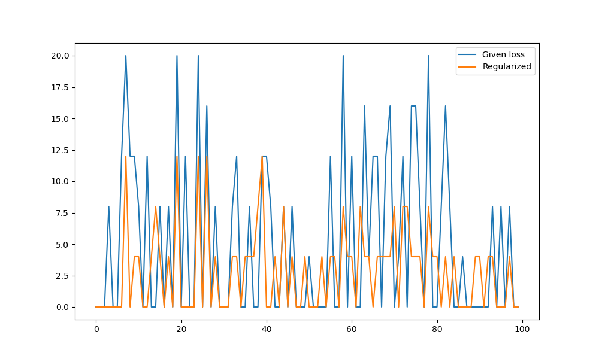

# Loss Function Evaluation

Evaluating proposed loss function with respect to the given loss function

## __Procedure__

* ...

## __Results__

It is evident from the above graph obtained that after applying regularization with a suitable lambda value, the loss calculated by the loss function is far reduced (__orange__) as compared to loss calculated by unregularized model (__blue__).

It is important to find the right tradeoff between training and testing error, so the optimal lambda value must be calculated. This is done with experiments such as cross validation.

## __Other Work__

* Under algorithms, I experimented with incorporating gradient descent with the proposed loss function and the data from the wine dataset. This helped to better understand the code written previously and was also beneficial to understanding if more optimizations can be included.
