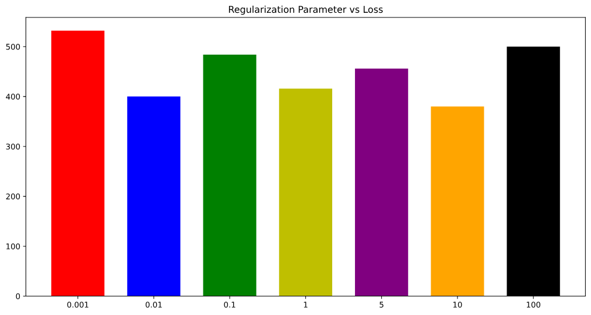

# Loss Function Evaluation

Evaluating proposed loss function with respect to the given loss function

## __Procedure__

* __100 random subsets__ of 10 wine samples each are chosen and a model (Logistic Regression, here) is fitted to the dataset.
* The best wine according to the actual labels is taken as the correct result and accordingly, the following loss function is implemented.
* A regularized model with varying c values is also used and loss is calculated as done above.

__Loss function__:

    def svm_loss(preds, ys, delta=0):
        correct = ys.argmax()
        score_correct = preds[correct]
        
        loss = 0
        
        for i, pred in enumerate(preds):
            loss += max(0, pred + delta - score_correct)            
                
        return loss

        
    - delta refers to margin between correct prediction and other possible predictions
    - score_correct is the correct prediction

## __Results__

It is evident from the above graph obtained that after applying regularization with a suitable lambda value, the loss calculated by the loss function is far reduced (__orange__) as compared to loss calculated by unregularized model (__blue__). Although some blue errors are zero whereas the corresponding orange is non-zero, the new loss must not be penalized for this, since the overall or average loss of the orange and the maximum loss is reduced.

It is important to find the right tradeoff between training and testing error, so the optimal lambda value must be calculated. This is done with experiments such as gridSearch, randomSearch.

## __Other Work__

* Under algorithms, I experimented with incorporating gradient descent with the proposed loss function and the data from the wine dataset. This helped to better understand the code written previously and was also beneficial to understanding if more optimizations can be included.

* GridSearch was conducted by varying penalties (l1 and l2) and c parameter values to find an optimum. The GridSearch used a custom loss function to evaluate best parameters:

        {'C': 0.01, 'penalty': 'l2'}

